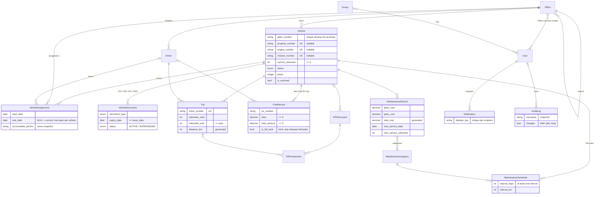

# VIMS ERD

Generated from the Django models (Phase 2). `Tracked` models also carry `created_at`, `updated_at`, `created_by → User`.

`Attachment` (not drawn) links a file to any record via a generic foreign key (`content_type`, `object_id`).

## Rules and where they're enforced

| Rule | Where |
|---|---|
| Plate unique among active vehicles | `Vehicle.clean()` (MySQL has no partial unique index) |
| One current assignment per vehicle | `VehicleAssignment.clean()`; Phase 5 service adds row locking |
| Non-negative odometer, liters, costs | DB CHECK |
| End date/odometer not before start | DB CHECK |
| Trip distance and maintenance total | DB generated columns |
| No duplicate threshold alerts | DB UNIQUE (`recipient`, `dedupe_key`) |
| Audit log append-only | Admin read-only; no write API |

## Roles (`python manage.py seed_reference`)

| Group | Model permissions |
|---|---|
| System Administrator | all, every VIMS app |
| Fleet Administrator | add/change/view on fleet, operations, maintenance; view offices |
| Field Office User | view fleet; add/change trips, fuel, tolls, maintenance records |
| Viewer | view only (no audit, no users) |

No role gets `delete` except System Administrator; records are archived instead. Office scoping (`User.offices`) is applied in Phase 3.
